# SKN14-FINAL-2Team

<<<<<<< HEAD
### ☘️ 팀명: ScentLab  
### 🌳 프로젝트명: ScentPick  
=======
### ☘️팀명: ScentLab
### 🌳홈페이지: ScentPick (https://scentpick.store)

### **🧴ScentPick: LLM 기반으로 맞춤형 향수를 추천하는 대화형 챗봇 서비스**
>>>>>>> 8d1479cf512c63c46337e233b8d1d59a1ef885c2

## 🧴 ScentPick: LLM 기반 맞춤형 향수 추천 챗봇 서비스

> ScentPick은 **대화형 RAG 기반 챗봇**으로, 사용자가 일상적인 언어(“여름 바닷가의 시원한 향”, “무겁지 않은 출근용 향”)로 입력하면  
AI가 이를 이해하고 개인 맞춤형 향수를 추천해주는 서비스입니다.  

- **기존 문제점**
  1. 수천 가지 향수 중 원하는 향을 찾기 어려움  
  2. 노트·어코드 등 전문 용어 중심 → 일반 소비자가 이해하기 어려움  
  3. 매장 접근성·높은 가격·시향 불가 문제  

<<<<<<< HEAD
- **해결 목표**  
  자연어 기반 대화형 인터페이스 + 벡터 검색 + 멀티모달 기능을 통해  
  사용자가 쉽게 본인 취향에 맞는 향수를 찾도록 지원  
=======
### 🎇 Features 🎇
- **RAG기반의 Chatbot** : 
    - RAG 기술로 향수 브랜드 전체 데이터베이스에서 필요한 부분을 가져오는 기능 
    - 로그인한 고객 대상으로 채팅 히스토리를 제공하는 기능 
    - 실시간으로 고객과 챗봇의 질의응답 대화가 가능
    - 이미지 업로드하면 분위기에 맞는 향수를 추천하는 **멀티모달** 기능  
- **사용자의 의견을 반영한 추천 시스템** :
    - 사용자가 원하는 노트와 향 종류를 반영하여 적절한 향수 제품을 추천하는 기능
      
- **간결하고 직관적인 UI** 

>>>>>>> 8d1479cf512c63c46337e233b8d1d59a1ef885c2

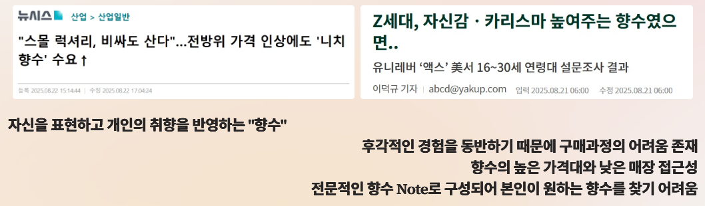

<<<<<<< HEAD
 
=======
- 개발 환경: Pycharm, VSCode
- 기술 스택

>>>>>>> 8d1479cf512c63c46337e233b8d1d59a1ef885c2

## 👨‍💻 팀원 소개

<<<<<<< HEAD
| **박빛나** | **유용환** | **한성규** | **강윤구** | **전정규** | **정유진** |
|:----------:|:----------:|:----------:|:----------:|:----------:|:----------:|
| 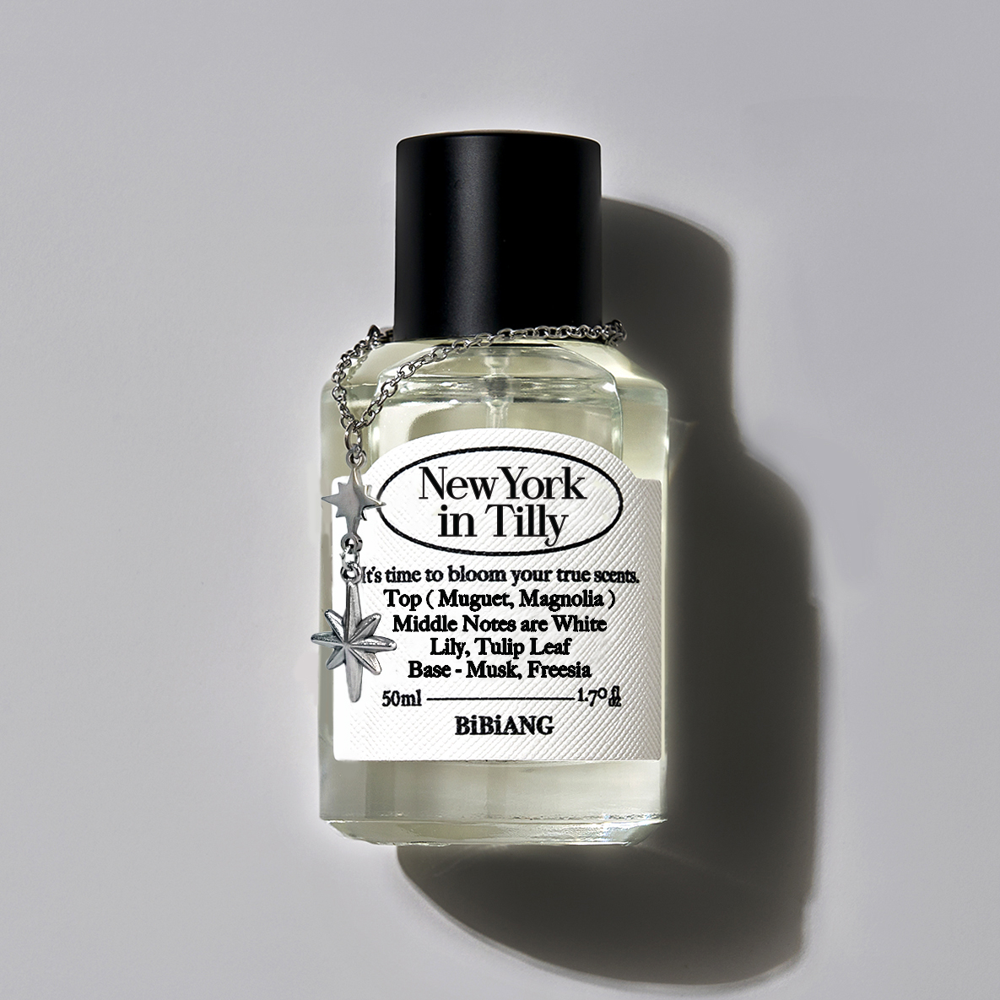 |  |  |  |  |  |
| [`@ParkVitna`](https://github.com/ParkVitna) | [`@yooyonghwan111`](https://github.com/yooyonghwan111) | [`@Seonggyu-Han`](https://github.com/Seonggyu-Han) | [`@dbsrn09`](https://github.com/dbsrn09) | [`@jeonggyu`](https://github.com/jeonggyu) | [`@rainbow0291`](https://github.com/rainbow0291) |
=======

### 📝 Table of Content

- 팀원소개
- ScentPick 챗봇서비스 소개
- 주요 기능
- 시스템 아키텍처
- 데이터 구조
- 향수 웹사이트 화면
- 인공지능 모델링
- 시스템 통합
- 최종 개발
- 기대 효과 
- Contact

### 팀원 소개

| 이름   | GitHub ID      | 업무                                                                                       |
|---------|----------------|------------------------------------------------------------------------------------------|
| 박빛나  | ParkVitna      | PM(프로젝트 매니저), 프로젝트 관리, 데이터 크롤링 및 정제, 프로젝트 기획서 작성, django ORM, AWS 배포, CI/CD               | 
| 유용환  | yooyonghwan111 | RM(리소스 매니저), Pinecone Vector DB 구축, wbs 작성, 데이터 조회 프로그램 작성, 시스템 아키텍처 구조, LangGraph 챗봇 설계 | 
| 한성규  | Seonggyu-Han   | 향수 데이터 수집, 전처리 및 정제, UI 구성,  API 조사, 데이터베이스 설계문서 작성, FastAPI, 챗봇, 웹사이트 페이지 검수      |
| 강윤구  | dbsrn09        | 향수 데이터 크롤링, 정제, 챗봇 사용자 입력 전처리 , 오프라인(map) 페이지, 상세페이지 및 마이페이지 검수,수정               | 
| 전정규  | jung33010      | 머신러닝 메인 어코드 추출 기능, FastAPI, LangGraph 챗봇 설계, AWS배포, CI/CD                                              | 
| 정유진  | rainbow0291    | UI 구성, 화면 설계 및 기능 구체화, README 파일, 회의록, 요구사항 정의서 작성, 상세페이지 작성                               | 

### 🧴ScentPick 챗봇서비스 소개

- 사용자가 원하는 조건에 맞게 향수를 3가지 추천해주는 챗봇 구현
- 향수 이름, 향수 브랜드, 향수 종류, 향 설명, 가격, 용량, 메인 어코드, 탑/미들/베이스 노트 데이터를 DB에 저장
- 참고 링크

### 📱 주요 기능
- **즐겨찾기** 기능: 로그인한 경우 마이페이지에 선택한 향수를 표시하는 기능
- **챗봇추천** 기능: 사용자가 작성한 조건에 맞게 3가지 향수를 추천해주는 기능
- 링크: 추천된 향수이름을 클릭하면 해당 제품 **상세페이지**로 연결되는 기능
- 로그인하고 마이페이지에서 챗봇과 **대화내역**chat history  저장, 표시되는 기능
- 향 설명, 탑/미들/베이스 노트, 용량 등의 **정보를 제공**하는 기능
- 향수노트/어코드/브랜드/이미지 등 도메인 엔터티 관리
- RAG 검색을 위한 임베딩/소스 문서 관리

* 초기 페이지 구상  

>>>>>>> 8d1479cf512c63c46337e233b8d1d59a1ef885c2

 

<<<<<<< HEAD
## 🛠️ 기술 스택
=======

  
- LLM_parser         : 2개 이상의 다중 제품 속성(facets) 쿼리를 파싱/정규화.
- FAQ_agent          : 향수 지식/정의/차이/일반 질문.
- human_fallback     : 비(非)향수 또는 오프토픽.
- price_agent        : 가격 전용 의도(cheapest, price, buy, discount 등).
- ML_agent           : 단일 취향/무드 추천 및 최근 추천 결과에 대한 FOLLOW-UP.
- memory_echo        : 사용자가 "방금 내가 뭐라고 했지?" / 마지막 질문을 묻는 경우.
- rec_echo           : 사용자가 "네가 방금 추천한 목록/이름 다시 보여줘"를 요청하는 경우.
>>>>>>> 8d1479cf512c63c46337e233b8d1d59a1ef885c2

| 카테고리 | 기술 |
|----------|------|
| **Backend** |   |
| **DevOps** |     |
| **Frontend** |   |
| **Data Collection** |    |
| **AI** |     |
| **Database** |   |

 

## 🧴 ScentPick 챗봇서비스 소개

- 사용자가 자연어 또는 이미지로 입력하면, AI가 향을 이해하고 향수를 추천  
- RAG 구조를 통해 **DB + VectorDB + LLM** 결합  
- 추천된 향수는 상세 페이지와 마이페이지에서 관리 가능  
- 날씨·계절·성별 기반 추천, 향수 월드컵(토너먼트) 등 콜드스타트 대응 기능 포함  

 

## 📱 주요 기능

- **챗봇 추천 (RAG 기반)**  
  - 사용자의 자유로운 언어 입력을 구조화 → 적합한 향수 추천  
  - 실시간 스트리밍 응답(SSE) → 타이핑 효과  

- **멀티모달 추천**  
  - 이미지 업로드 시 GPT-4o-mini가 분석 → 분위기/계절/성별 기반 추천  

- **추천 페이지**  
  - 오늘의 날씨·계절과 로그인한 사용자 성별 반영  
  - 향수 월드컵(토너먼트)로 취향 탐색  

- **향수 전체 목록 페이지**  
  - 모든 향수 데이터를 보여주는 카탈로그 페이지  
  - 브랜드, 성별, 농도, 메인 어코드 등 다양한 조건으로 필터링이 가능

- **향수 상세 페이지**  
  - 개별 향수의 상세 정보(설명, 노트 구성, 용량 등) 확인  
  - 사용자별 즐겨찾기 추가/제거, 좋아요/싫어요 피드백 가능

- **오프라인 매장 안내**  
  - 카카오맵 API 기반으로 주변 향수 매장 검색 및 지도 표시  

- **마이페이지**  
  - 추천 내역 확인 (날짜, 브랜드, 횟수)  
  - 좋아요/싫어요/즐겨찾기 관리  
  - 프로필 수정 및 이미지 업로드 (S3 저장)  

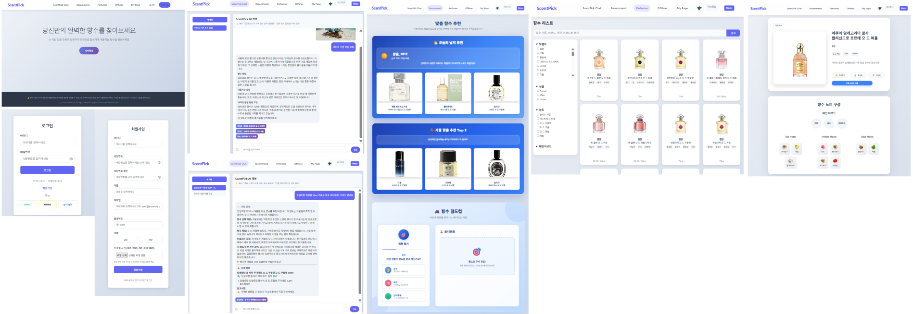
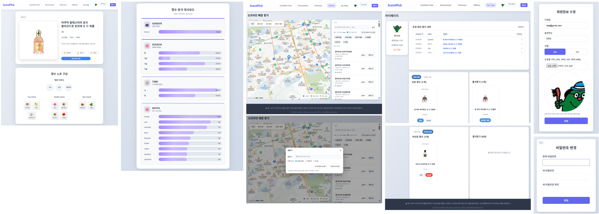

 

## 🖥️ 시스템 아키텍처

<<<<<<< HEAD
- **Frontend (Django Template)**  
  로그인/회원가입, 챗봇 UI, 추천 결과, 마이페이지  

- **Backend (FastAPI)**  
  멀티에이전트 라우터 (LangGraph 기반)  
  - Supervisor → LLM_parser, ML_agent, review_agent, price_agent, multimodal_agent, FAQ_agent 등으로 라우팅  
  - Pinecone VectorDB와 OpenAI GPT-4o-mini를 결합한 RAG 응답 생성  

- **Database (AWS RDS, Pinecone, S3)**  
  - RDS: 유저·대화·추천 로그 관리  
  - S3: 이미지 저장 (프로필, 향수 이미지)  
  - Pinecone: 향수 스펙·리뷰·키워드 임베딩 벡터 검색  
=======

### 🔢데이터 구조 
  

### 향수 웹사이트 화면  
 1. 메인화면    
 2. 챗봇 페이지    
 3. 추천 페이지(날씨에 따른 추천 등)    
 4. 전체 향수 리스트 페이지(조건에 따른 필터링 가능)    
 5. 상세페이지(802개의 향수 특징- 성별/계절별/시간대별/노트별 특성)    
 6. 오프라인 페이지(향수 매장 지도)   
 7. 마이페이지(즐겨찾기, 선호/비선호, 추천받은 향수 목록)   
 8. 로그인페이지    
 9. 회원가입페이지    

### 인공지능 모델링
- 사용자의 자연어 향 설명에서 적절한 향수 메인 어코드를 분류
- LLM 활용 모델 개발(자연어 입력하면 핵심 속성 추출(향 설명, 가격, 브랜드, 용량 등))
- LangChain + OpenAI 연동
- 시스템 아키텍처 설계
- HuggingFace dataset 머신러닝 다중분류모델 성능 평가
- 원본데이터    

- 향 설명과 메인 어코드 추출 
- ① 수집 → ② 결측치 처리 → ③ 불필요 단어 제거 → ④ 브랜드/향수명 제거 → ⑤ 숫자/특수문자 제거 → ⑥ 소문자 변환 → ⑦ 학습/검증 데이터 분리
- 허깅페이스 데이터셋 최종 채택 모델: 
- XLM-Roberta base + Classification Head
 (transformers.AutoModelForSequenceClassification, problem_type="multi_label_classification")	
   

   
- **학습 결과 및 성능 평가**
   

   
- 주요 지표(검증 셋)
- threshold=0.5 기준 Epoch 5~7 최고점
- Micro-F1 ≈ 0.53
- Macro-F1 ≈ 0.33~0.34
- Jaccard ≈ 0.42~0.43
- 참고: 검증 Loss는 Epoch 5 이후 상승(과적합 경향), Micro-F1도 이후 정체/하락 
→ 5~7 사이 모델이 가장 타당.
결론: XLM-R 파인튜닝 + pos_weight + label threshold로 Micro-F1≈0.53 달성
>>>>>>> 8d1479cf512c63c46337e233b8d1d59a1ef885c2

## 🔗 시스템 통합

- Django와 FastAPI를 API로 연동  
- SSE 기반 스트리밍 응답 구현  
- OAuth2 소셜 로그인(Google, Kakao, Naver)  
- AWS 환경 배포 (Elastic Beanstalk, EC2, RDS, S3, Route53)  
- Docker 기반 CI/CD 파이프라인  

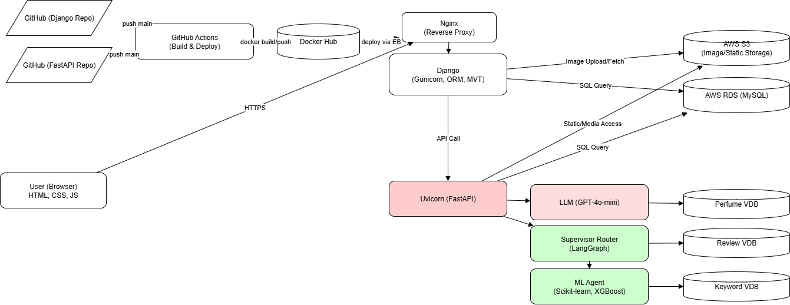

 

## 🔢 데이터 구조

- **MySQL (RDS)**  
  - perfumes: 향수 기본 정보  
  - note_images: 노트별 이미지  
  - users / user_detail: 회원 정보  
  - conversations / messages: 대화 세션 기록  
  - favorites / feedback_events: 좋아요·싫어요·즐겨찾기  
  - rec_runs / rec_candidates: 추천 실행 기록  

- **Pinecone Vector DB**  
  - perfume-vectordb: 향수 스펙 (802개)  
  - review-vectordb: 사용자 리뷰 (6,591건)  
  - keyword-vectordb: 노트-어코드 매핑 (53개)  

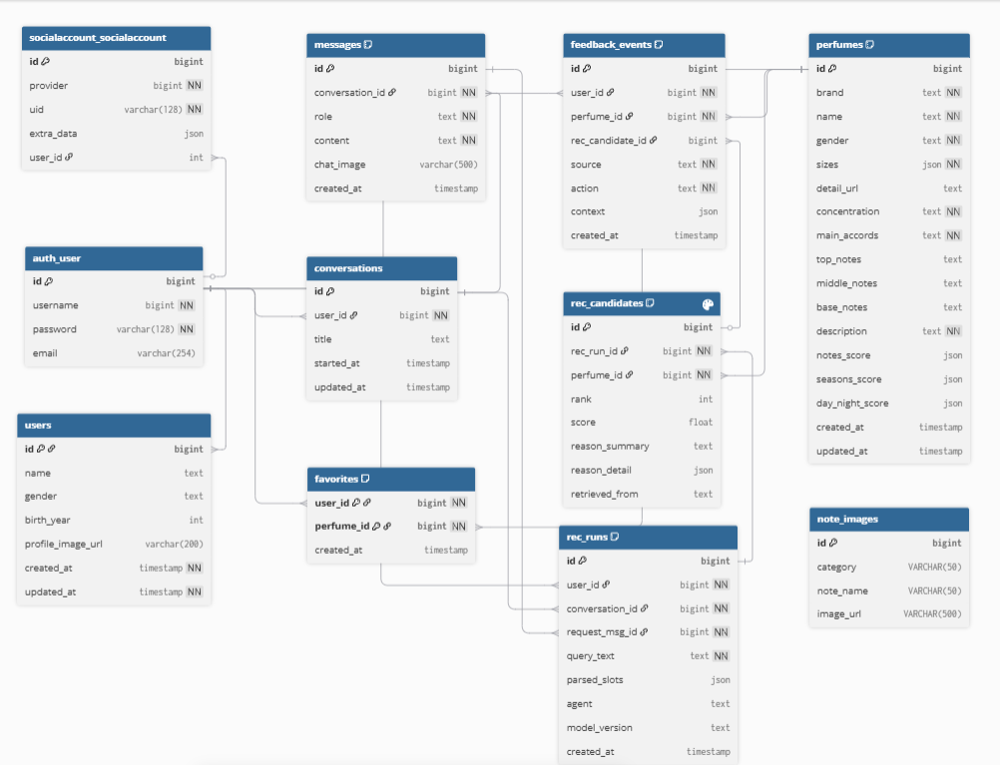

<<<<<<< HEAD
 

## 🖼️ 향수 웹사이트 화면

## 🖼️ 향수 웹사이트 화면

| 페이지 | 화면 예시 |
|--------|-----------|
| **메인 페이지** | 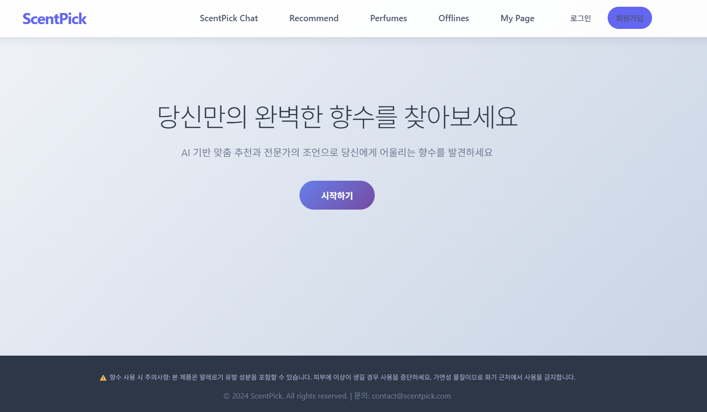 |
| **향수 목록 페이지** | 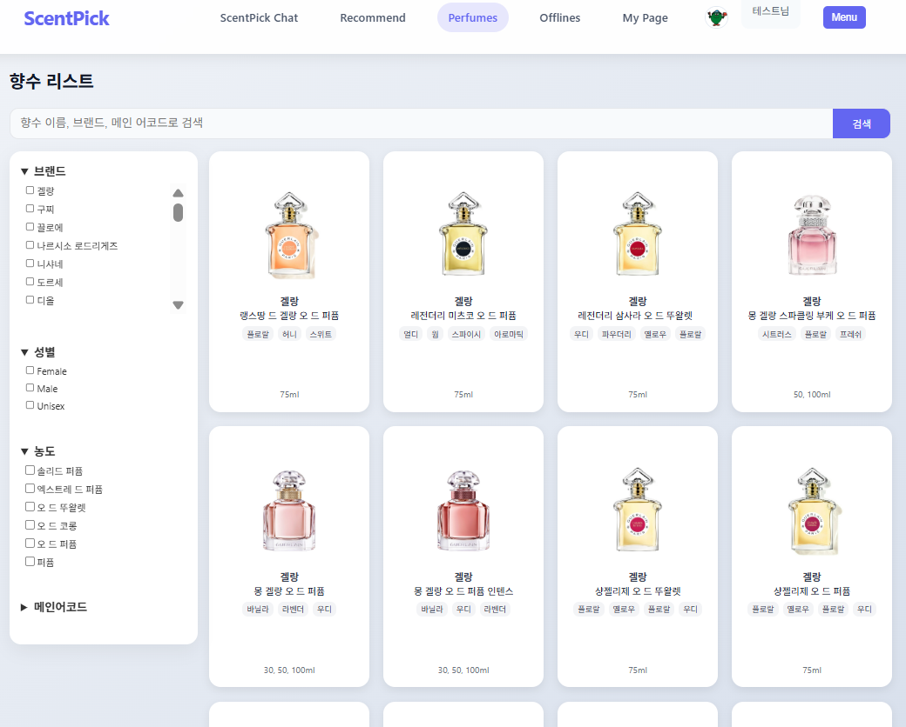 |
| **향수 상세 페이지** | 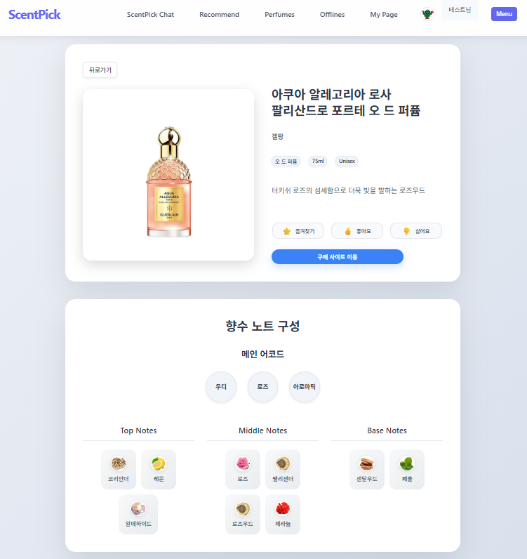 |
| **챗봇 추천** | 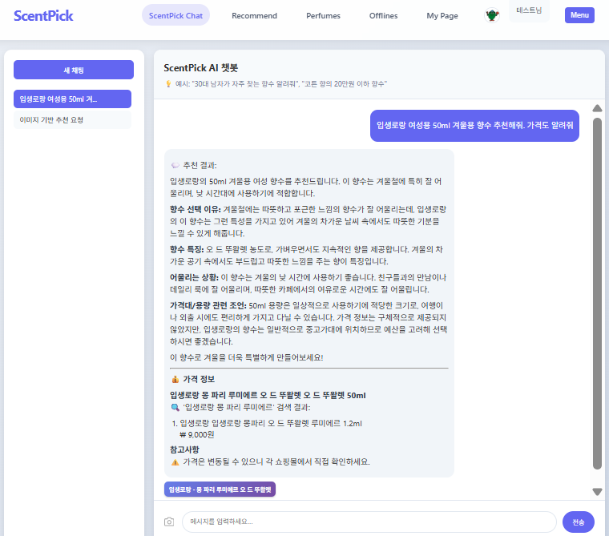 |
| **멀티모달 추천** | 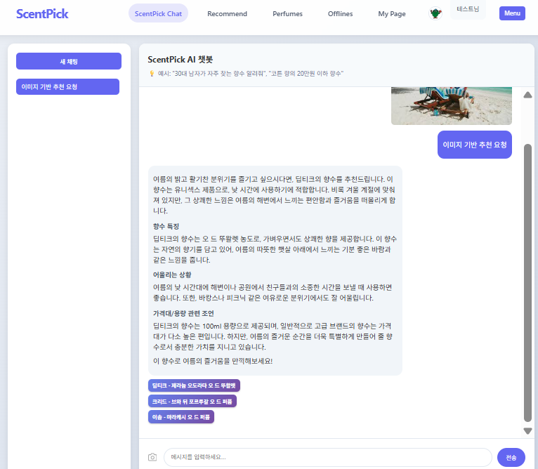 |
| **추천 페이지** | 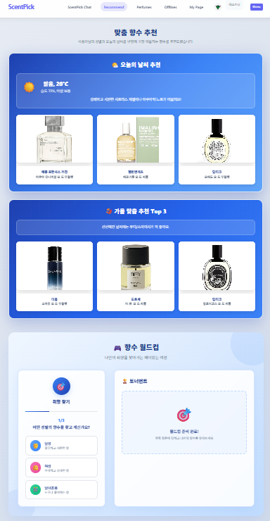 |
| **오프라인 매장 안내** | 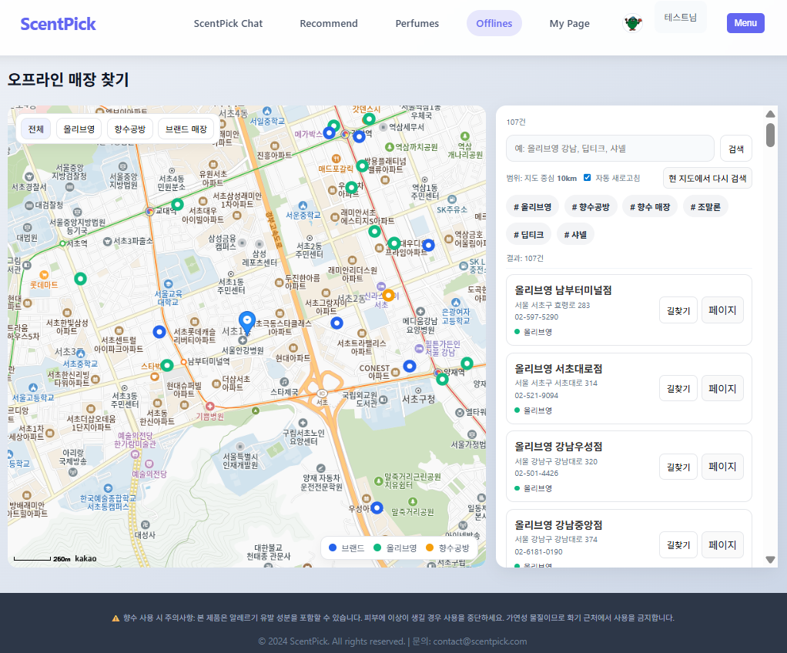 |
| **마이페이지** | 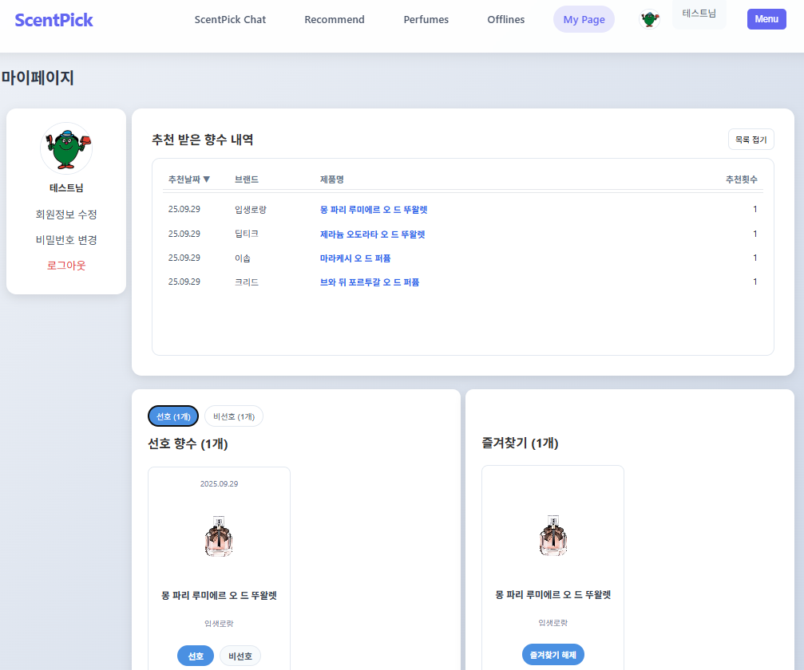 |

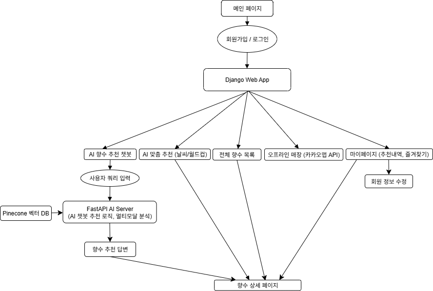
 

## 🤖 인공지능 모델링

- **LLM**: OpenAI GPT-4o-mini  
- **임베딩 모델**: text-embedding-3-small, paraphrase-multilingual-MiniLM-L12-v2  
- **RAG 구조**: Pinecone VectorDB + LLM 조합  
- **멀티에이전트 라우팅**: LangGraph 기반 Supervisor + 전문 에이전트  

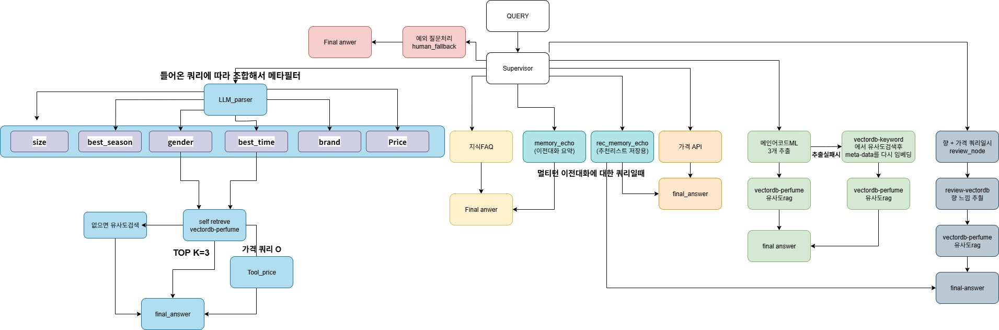

 

## 🤖 머신러닝 모델

- **목표**: 영어 description 텍스트로부터 다중 라벨(Main Accord) 예측  
- **모델 계열**: 다국어 임베딩 + 머신러닝 분류기  
- **최종 채택**:  
  - 임베딩: `paraphrase-multilingual-MiniLM-L12-v2` (SentenceTransformer)  
  - 분류기: VotingClassifier (Soft Voting, Logistic Regression + XGBoost)  

👉 MiniLM은 다국어 입력 확장이 가능하고, Soft Voting 앙상블은 단일 모델 대비 안정성과 성능을 개선

- **학습 데이터**: 약 26,000개 (희소·노이즈 라벨 제거 후)  
- **성능**: Micro-F1 ≈ **0.50** (목표 성능 달성)  
- **저장 방식**:  
  - `minilm_model.pt` (임베딩 모델)  
  - `label_info.pkl` (분류기 및 라벨 정보)  

 

## 🗄️ VectorDB

- **목적**: LLM과 연동해 향수 추천·FAQ 응답·가격 질의 등을 보조  
- **플랫폼**: Pinecone (AWS us-east-1, Serverless, 1536차원, cosine similarity)  
- **임베딩 모델**: `text-embedding-3-small`  

### 인덱스 구성
- **perfume-vectordb**: 향수 스펙 기반 (802건)  
  - page_content: 향 설명  
  - metadata: 브랜드, 농도, 성별, 계절 점수 등  

- **review-vectordb**: 사용자 리뷰 기반 (6,591건)  
  - page_content: 리뷰 본문  
  - metadata: url + text  

- **keyword-vectordb**: 키워드-어코드 매칭 (53건)  
  - page_content: `"note: Rose | accord: Floral"` 형태 문자열  
  - metadata: id + 원문 텍스트  

 

## 📹 시연 동영상

 

## 🚩 기대 효과

- **사용자 편의성**: 전문 지식 없이도 맞춤 향수 선택 가능  
- **데이터 기반 추천**: 인기 순위가 아닌 리뷰·향 설명 기반 추천  
- **시장 가치**: 정보 비대칭 해소, 구매 만족도 및 재구매율 향상  
- **확장성**: 디퓨저, 섬유유연제 등 향 기반 제품군으로 확장 가능  

 

## 📢 Contact

- 팀 노션: [Notion](https://www.notion.so/shqkel/SKN14-Final-2-24c9cb46e5e28024a084f0508d66d217?source=copy_link)  
- GitHub 메인 저장소: [Final Repo](https://github.com/skn-ai14-250409/SKN14-Final-2Team)  
- GitHub Django Web: [Web Repo](https://github.com/skn-ai14-250409/SKN14-Final-2Team-Web)  
- GitHub FastAPI: [AI Repo](https://github.com/skn-ai14-250409/SKN14-Final-2Team-Ai)  
=======
### 📢 Contact
- 프로젝트 노션: https://www.notion.so/shqkel/SKN14-Final-2-24c9cb46e5e28024a084f0508d66d217?source=copy_link
- Github SKN14기 저장소: https://github.com/skn-ai14-250409/SKN14-Final-2Team
- Github SKN전체 저장소: https://github.com/SKNETWORKS-FAMILY-AICAMP/SKN14-FINAL-2Team
- **향수 Scentpick** : https://scentpick.store/

>>>>>>> 8d1479cf512c63c46337e233b8d1d59a1ef885c2
