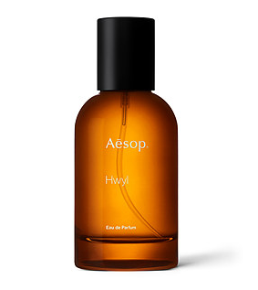
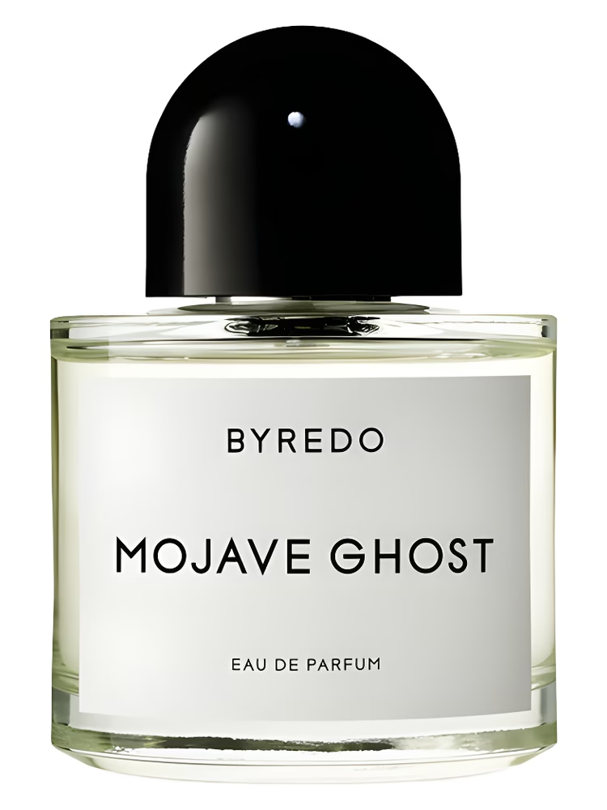
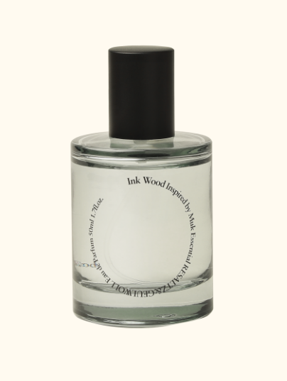
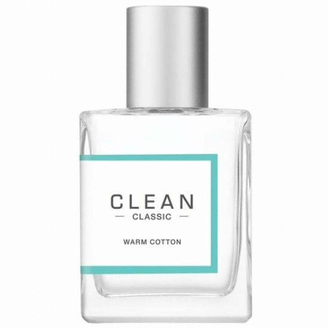
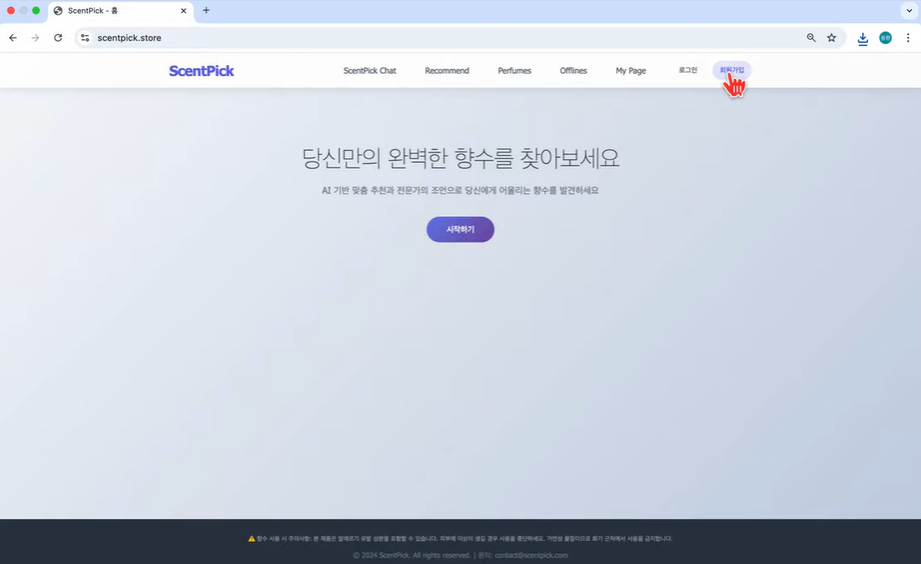

# SKN14-FINAL-2Team

### ☘️팀명: ScentLab
### 🌳프로젝트명: ScentPick (https://scentpick.store)

### **🧴ScentPick: LLM 기반으로 맞춤형 향수를 추천하는 대화형 챗봇 서비스**

> ScentPick은 **대화형 RAG 기반 챗봇**으로, 사용자가 일상적인 언어(“여름 바닷가의 시원한 향”, “무겁지 않은 출근용 향”)로 입력하면  
AI가 이를 이해하고 개인 맞춤형 향수를 추천해주는 서비스입니다.  

- **기존 문제점**
  1. 수천 가지 향수 중 원하는 향을 찾기 어려움  
  2. 노트·어코드 등 전문 용어 중심 → 일반 소비자가 이해하기 어려움  
  3. 매장 접근성·높은 가격·시향 불가 문제  

- **해결 목표**  
  자연어 기반 대화형 인터페이스 + 벡터 검색 + 멀티모달 기능을 통해  
  사용자가 쉽게 본인 취향에 맞는 향수를 찾도록 지원  

 

## 👨‍💻 팀원 소개

| **박빛나** | **유용환** | **한성규** | **강윤구** | **전정규** | **정유진** |
|:----------:|:----------:|:----------:|:----------:|:----------:|:----------:|
|  |  |  |  |  |  |
| [`@ParkVitna`](https://github.com/ParkVitna) | [`@yooyonghwan111`](https://github.com/yooyonghwan111) | [`@Seonggyu-Han`](https://github.com/Seonggyu-Han) | [`@dbsrn09`](https://github.com/dbsrn09) | [`@jeonggyu`](https://github.com/jeonggyu) | [`@rainbow0291`](https://github.com/rainbow0291) |

 

## 🛠️ 기술 스택

| 카테고리 | 기술 |
|----------|------|
| **Backend** |   |
| **DevOps** |     |
| **Frontend** |   |
| **Data Collection** |    |
| **AI** |     |
| **Database** |   |

 

## 🧴 ScentPick 챗봇서비스 소개

- 사용자가 자연어 또는 이미지로 입력하면, AI가 향을 이해하고 향수를 추천  
- RAG 구조를 통해 **DB + VectorDB + LLM** 결합  
- 추천된 향수는 상세 페이지와 마이페이지에서 관리 가능  
- 날씨·계절·성별 기반 추천, 향수 월드컵(토너먼트) 등 콜드스타트 대응 기능 포함  

 

## 📱 주요 기능

- **챗봇 추천 (RAG 기반)**  
  - 사용자의 자유로운 언어 입력을 구조화 → 적합한 향수 추천  
  - 실시간 스트리밍 응답(SSE) → 타이핑 효과  

- **멀티모달 추천**  
  - 이미지 업로드 시 GPT-4o-mini가 분석 → 분위기/계절/성별 기반 추천  

- **추천 페이지**  
  - 오늘의 날씨·계절과 로그인한 사용자 성별 반영  
  - 향수 월드컵(토너먼트)로 취향 탐색  

- **향수 전체 목록 페이지**  
  - 모든 향수 데이터를 보여주는 카탈로그 페이지  
  - 브랜드, 성별, 농도, 메인 어코드 등 다양한 조건으로 필터링이 가능

- **향수 상세 페이지**  
  - 개별 향수의 상세 정보(설명, 노트 구성, 용량 등) 확인  
  - 사용자별 즐겨찾기 추가/제거, 좋아요/싫어요 피드백 가능

- **오프라인 매장 안내**  
  - 카카오맵 API 기반으로 주변 향수 매장 검색 및 지도 표시  

- **마이페이지**  
  - 추천 내역 확인 (날짜, 브랜드, 횟수)  
  - 좋아요/싫어요/즐겨찾기 관리  
  - 프로필 수정 및 이미지 업로드 (S3 저장)  

 

## 🖥️ 시스템 아키텍처

- **Frontend (Django Template)**  
  로그인/회원가입, 챗봇 UI, 추천 결과, 마이페이지  

- **Backend (FastAPI)**  
  멀티에이전트 라우터 (LangGraph 기반)  
  - Supervisor → LLM_parser, ML_agent, review_agent, price_agent, multimodal_agent, FAQ_agent 등으로 라우팅  
  - Pinecone VectorDB와 OpenAI GPT-4o-mini를 결합한 RAG 응답 생성  

- **Database (AWS RDS, Pinecone, S3)**  
  - RDS: 유저·대화·추천 로그 관리  
  - S3: 이미지 저장 (프로필, 향수 이미지)  
  - Pinecone: 향수 스펙·리뷰·키워드 임베딩 벡터 검색  

## 🔗 시스템 통합

- Django와 FastAPI를 API로 연동  
- SSE 기반 스트리밍 응답 구현  
- OAuth2 소셜 로그인(Google, Kakao, Naver)  
- AWS 환경 배포 (Elastic Beanstalk, EC2, RDS, S3, Route53)  
- Docker 기반 CI/CD 파이프라인  

 

## 🔢 데이터 구조

- **MySQL (RDS)**  
  - perfumes: 향수 기본 정보  
  - note_images: 노트별 이미지  
  - users / user_detail: 회원 정보  
  - conversations / messages: 대화 세션 기록  
  - favorites / feedback_events: 좋아요·싫어요·즐겨찾기  
  - rec_runs / rec_candidates: 추천 실행 기록  

- **Pinecone Vector DB**  
  - perfume-vectordb: 향수 스펙 (802개)  
  - review-vectordb: 사용자 리뷰 (6,591건)  
  - keyword-vectordb: 노트-어코드 매핑 (53개)  

 

## 🖼️ 향수 웹사이트 화면

| 페이지 | 화면 예시 |
|--------|-----------|
| **메인 페이지** |  |
| **향수 목록 페이지** |  |
| **향수 상세 페이지** |  |
| **챗봇 추천** |  |
| **멀티모달 추천** |  |
| **추천 페이지** |  |
| **오프라인 매장 안내** |  |
| **마이페이지** |  |

 

## 🤖 인공지능 모델링

- **LLM**: OpenAI GPT-4o-mini  
- **임베딩 모델**: text-embedding-3-small, paraphrase-multilingual-MiniLM-L12-v2  
- **RAG 구조**: Pinecone VectorDB + LLM 조합  
- **멀티에이전트 라우팅**: LangGraph 기반 Supervisor + 전문 에이전트  

 

## 🤖 머신러닝 모델

- **목표**: 영어 description 텍스트로부터 다중 라벨(Main Accord) 예측  
- **모델 계열**: 다국어 임베딩 + 머신러닝 분류기  
- **최종 채택**:  
  - 임베딩: `paraphrase-multilingual-MiniLM-L12-v2` (SentenceTransformer)  
  - 분류기: VotingClassifier (Soft Voting, Logistic Regression + XGBoost)  

👉 MiniLM은 다국어 입력 확장이 가능하고, Soft Voting 앙상블은 단일 모델 대비 안정성과 성능을 개선

- **학습 데이터**: 약 26,000개 (희소·노이즈 라벨 제거 후)  
- **성능**: Micro-F1 ≈ **0.50** (목표 성능 달성)  
- **저장 방식**:  
  - `minilm_model.pt` (임베딩 모델)  
  - `label_info.pkl` (분류기 및 라벨 정보)  

 

## 🗄️ VectorDB

- **목적**: LLM과 연동해 향수 추천·FAQ 응답·가격 질의 등을 보조  
- **플랫폼**: Pinecone (AWS us-east-1, Serverless, 1536차원, cosine similarity)  
- **임베딩 모델**: `text-embedding-3-small`  

### 인덱스 구성
- **perfume-vectordb**: 향수 스펙 기반 (802건)  
  - page_content: 향 설명  
  - metadata: 브랜드, 농도, 성별, 계절 점수 등  

- **review-vectordb**: 사용자 리뷰 기반 (6,591건)  
  - page_content: 리뷰 본문  
  - metadata: url + text  

- **keyword-vectordb**: 키워드-어코드 매칭 (53건)  
  - page_content: `"note: Rose | accord: Floral"` 형태 문자열  
  - metadata: id + 원문 텍스트  

 

## 📹 시연 동영상

 

## 🚩 기대 효과

- **사용자 편의성**: 전문 지식 없이도 맞춤 향수 선택 가능  
- **데이터 기반 추천**: 인기 순위가 아닌 리뷰·향 설명 기반 추천  
- **시장 가치**: 정보 비대칭 해소, 구매 만족도 및 재구매율 향상  
- **확장성**: 디퓨저, 섬유유연제 등 향 기반 제품군으로 확장 가능  

 

## 🗣️ 프로젝트 한줄 회고

| 이름      | 한 줄 회고                               |
| ------- | ------------------------------------ |
| **박빛나** | PM이 처음이라 팀원들을 고생시킨 거 같은데... ㅎㅎㅎ 향수 추천이라는 주제로 재밌게 LLM을 적용해보고 웹페이지를 만들어봐서 즐거웠습니다~! |
| **강윤구** | 향수라는 낯선 도메인을 다루면서도 데이터 정리부터 챗봇 구현까지 배울 점이 많았고, 다 같이 결과물을 완성해내서 뿌듯했습니다. |
| **유용환** | RAG 기반 추천 모델과 스트리밍 챗봇을 구현하며 AI 기술을 서비스로 확장하는 경험을 했고, 그 과정에서 배움과 협업의 가치를 깊이 느꼈다. |
| **전정규** | AI과정에서 배운 지식들을 팀원들과 함께 펼쳐볼수있는 기회를 잘 활용한것같아서  좋았습니다.팀원분들 모두 고생 많이하셨습니다. |
| **정유진** | 이번 파이널 프로젝트는 특히 더욱 유익하고 즐거운 경험이었습니다! |
| **한성규** | 지금 내가 어떤 작업을 하고 있는지, 이 작업이 팀내에서 원래 하기로 합의된 방향이 맞는지 중간중간 스스로 돌아봐야 한다는 점. 팀원들과의 소통이 프로젝트에서 중요한 역할을 하는지에 대해 다시 깨닫게 되는 프로젝트였습니다. 2달간 함께 노력해주신 팀원분들 고생 많으셨습니다~ 감사합니다🙇 |

## 📢 Contact

- 팀 노션: [Notion](https://www.notion.so/shqkel/SKN14-Final-2-24c9cb46e5e28024a084f0508d66d217?source=copy_link)  
- GitHub 메인 저장소: [Final Repo](https://github.com/skn-ai14-250409/SKN14-Final-2Team)  
- GitHub Django Web: [Web Repo](https://github.com/skn-ai14-250409/SKN14-Final-2Team-Web)  
- GitHub FastAPI: [AI Repo](https://github.com/skn-ai14-250409/SKN14-Final-2Team-Ai)  